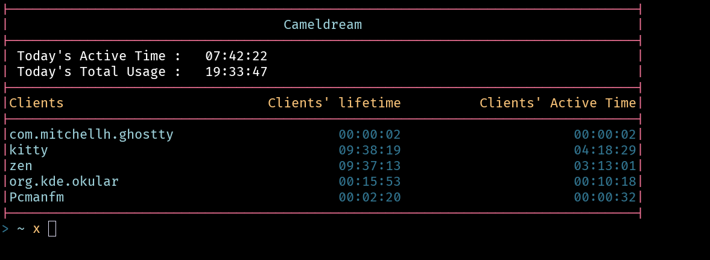

# Cameldream

> [!NOTE]
> This is a rewrite of [welldream](https://github.com/laeva-lady/welldream)
> code was messy and i didn't like go's messyness that much

> [!WARNING]
> This project only supports Hyprland

Log and display your app usage



## Usage
- `cameldream server` spawns the server
- `cameldream watch` prints the usage in a loop
- `cameldream` only prints the usage once

## Cache
It keeps cache here `~/.cache/wellness`

## Install

> [!CAUTION]
> Make sure wherever you put the binary is in your $PATH

from the project's root folder:
```bash
dune install
# you can use the makefile instead:
make install-opam
```
binary will be put here `~/.opam/default/bin/cameldream`

you can change the install location by puttin a prefix:
```bash
dune install --prefix ~/.local
# you can use the makefile instead:
make install-local
```
binary will be put here `~/.local/bin/cameldream`

## As a Daemon
1. you can adapt the available service example file to start the server as a systemd unit
2. then put the file in `~/.config/systemd/user`
3. then reload systemd daemon if needed `systemctl --user daemon-reload`
3. then start the service `systemctl --user start cameldream.service`


## todo
 - [ ] add weekly report
 - [ ] add monthy report
 - [x] add sorting
 - [x] change sorting to sort by most used app instead of alphabetically
 - [x] IMPORTANT: switch to using Hyprland's IPC instead of polling every second
 - [ ] add web front end
